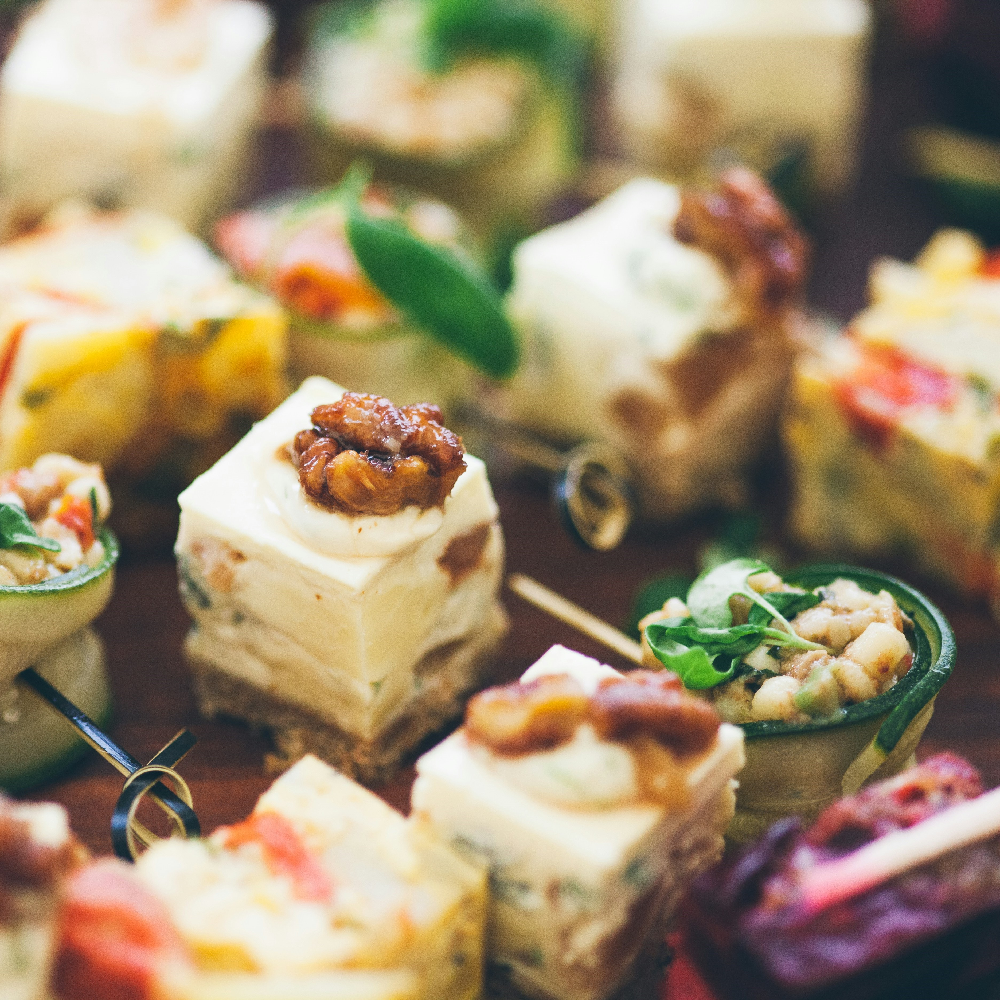
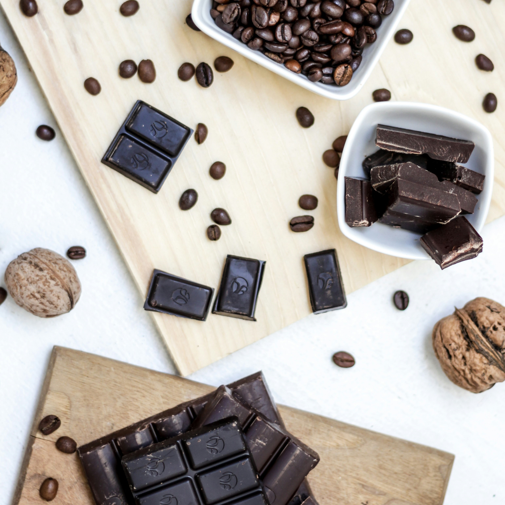
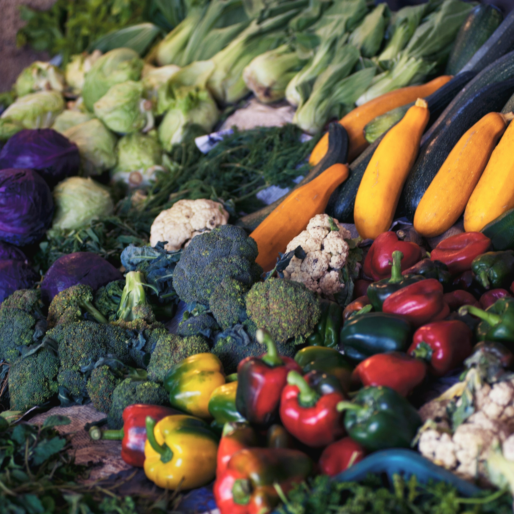
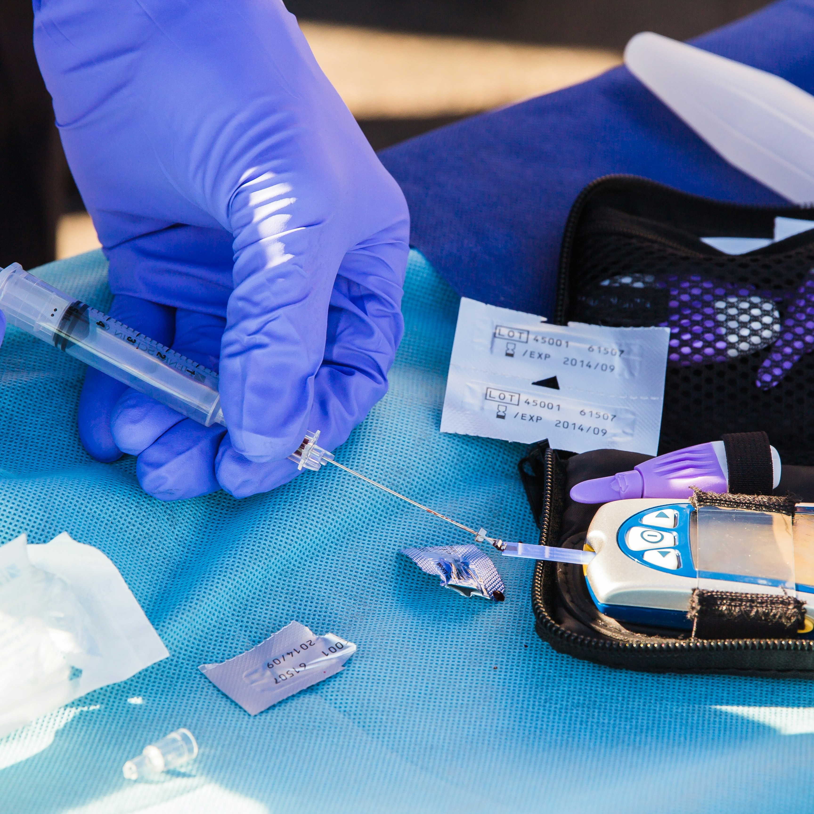
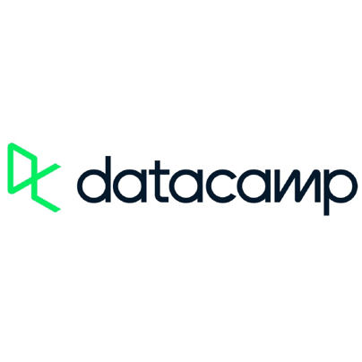
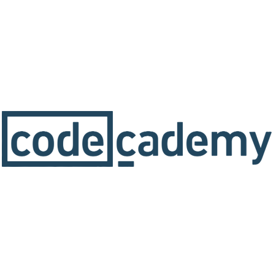

# Portfolio
I have more than seven years of experience in data analysis, marketing, sales and finance. In 2022, I started learning Python and dove into data science and machine learning. I earned professional certificates from Codecademy and DataCamp. This is a compilation of some of my projects in data analysis, data science and data visualization. Many have originated from courses and competitions I took part in or hobbies and personal interests. 

I'm happy to get in touch on [Linkedin](https://se.linkedin.com/in/tsvetinakirova).

## Projects

 **[Predict Popularity of Recipes](https://github.com/Tsvetina17/Portfolio/blob/main/assets/Predict%20Popularity%20of%20Recipes.ipynb)**

The goal of the project is to build a model for predicting which recipes will be popular 80% of the time and minimize the chance of showing unpopular recipes. The Logistic Regression model with GridSearchCV achieves this goal and performs better than a comparison Random Forest model. 

#

 **[Find the Best Chocolate Bars](https://github.com/Tsvetina17/Portfolio/blob/main/assets/Find%20the%20Best%20Chocolate%20Bars.ipynb)**

I use statistics and data visualization to find the characteristics of highly-rated chocolate bars. Visualizations with matplotlib, Plotly Express and WordCloud help analyze numeric data, geospatial data and reviews. Bootstrapping suggests significant empirical evidence that the mean rating of chocolate bars without lecithin is higher than that of bars with lecithin.

#

 **[Predict Hotel Cancellations](https://github.com/Tsvetina17/Portfolio/blob/main/assets/Predict%20Hotel%20Cancellations.ipynb)**

I build different machine learning models to predict cancellations at a hotel. The random forest and decision tree models perform similarly and have higher accuracy than the logistic regression model. The simple neural network has good accuracy but I recommend to focus on the tree models since they perform equally well and are easier to interpret.

#

 **[What is Good Food?](https://github.com/Tsvetina17/Portfolio/blob/main/assets/What%20is%20Good%20Food.ipynb)**

I analyze data from USDA's FoodData Central using data visualization, descriptive statistics, correlation and regression. I build a linear regression model to predict the calories in food items. I use a scatterplot and calculate the Pearson correlation coefficient to show that higher content of water is correlated with less calories.

#

 **[Predict the Risk of Diabetes](https://github.com/Tsvetina17/Portfolio/blob/main/assets/Predict%20the%20Risk%20of%20Diabetes.ipynb)**

The data is imbalanced, skewed and contains a lot of missing values so I use imputation with median and stratified sampling. I train various classification models and apply GridSearchCV to fine-tune the parameters of the model that performs best. I use the final model to predict the risk of diabetes for a person with specific traits.

#

 **[Draw Flowers with Python](https://github.com/Tsvetina17/Portfolio/blob/main/assets/Draw%20Flowers%20with%20Python.ipynb)**

I experiment with turtle and matplotlib to draw the flowers and use colorsys to achieve colorful hues. Users can choose a variety of parameters for the flowers such as color and number of petals. This project presents some of the most successful functions that are a result of this experiment.

#

## Certification
 **[DataCamp](https://www.datacamp.com/)**

* [Data Scientist](https://www.datacamp.com/certificate/DS0026530264875): Collect, analyze and interpret large amounts of data using machine learning and AI; Apply sampling methods and carry out statistical tests.
* [Data Analyst](https://www.datacamp.com/certificate/DA0025309633761): Use Python and SQL to answer business critical questions, visualize data and communicate results from data analysis

#

 **[Codecademy](https://www.codecademy.com/)**

* Data Scientist, Analytics: Use Python and SQL to query, analyze, and visualize data
* Machine Learning/AI Engineer: Use Python, Git and ML to build predictive models, end-to-end applications and neural networks
* Business Intelligence: Use Python, SQL and Tableau to analyze and visualize data

#

Note: Photographs are from Unsplash and logos belong to the respective companies. The rest is personal work.
